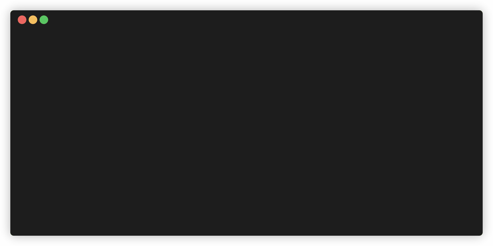

# switch_gcp_env
`switch_gcp_env` is a CLI tool designed to simplify the process of switching between Google Cloud Platform (GCP) projects and configurations directly from the command line. It aims to help developers managing multiple GCP environments, enabling them to switch context swiftly and accurately without manual updates to configuration files or environment settings.

## Prerequisites
Before using `switch_gcp_env`, it's important to note the following prerequisites:
- You should have gcloud and kubectl toolsets instealled in the terminal
- You should be using the same user account across different GCP environments. This tool is designed with this assumption in mind, making it ideal for managing lower environments like `dev` and `qa`. It is not recommended to use this tool for switching between projects in high environments like `prod`, where more stringent access controls might be necessary.

## Usage
```bash
switch_gcp_env <project_id> [--cluster-name <name>] [--zone <zone>]
```
- `<project_id>`: The GCP project ID you want to switch to. This is a required field.
- `--cluster-name <name>`: Optional. Specifies the name of the Kubernetes cluster you want to use within the provided GCP project.
- `--zone <zone>`: Optional. Defines the GCP zone where the Kubernetes cluster is located.



## Installation

### From Binaries

**Linux:**
```bash
curl -L https://github.com/ariesslin/switch_gcp_env/releases/download/0.0.1/switch_gcp_env-0.0.1-x86_64-unknown-linux-gnu > switch_gcp_env && \
    chmod +x switch_gcp_env && \
    sudo mv switch_gcp_env /usr/local/bin/switch_gcp_env
```

**macOS (Intel):**
```bash
curl -L https://github.com/ariesslin/switch_gcp_env/releases/download/0.0.1/switch_gcp_env-0.0.1-x86_64-apple-darwin
 > switch_gcp_env && \
    chmod +x switch_gcp_env && \
    sudo mv switch_gcp_env /usr/local/bin/switch_gcp_env
```

**macOS (Apple Silicon):**
```bash
curl -L https://github.com/ariesslin/switch_gcp_env/releases/download/0.0.1/switch_gcp_env-0.0.1-aarch64-apple-darwin > switch_gcp_env && \
    chmod +x switch_gcp_env && \
    sudo mv switch_gcp_env /usr/local/bin/switch_gcp_env
```


**Windows:**

Download the latest release from [GitHub Releases](https://github.com/ariesslin/switch_gcp_env/releases). Then, move the downloaded executable to a directory within your PATH, for example:

```powershell
Move-Item -Path .\switch_gcp_env.exe -Destination C:\Windows\System32
```

### From Cargo
To install `switch_gcp_env` directly from the repository, use the following command:
```bash
cargo install --git https://github.com/ariesslin/switch_gcp_env
```
**Note**: If you encounter issues with repository authentication during installation, you may need to configure Cargo to use the Git executable for fetching dependencies. This leverages Git's authentication mechanisms, which can be particularly helpful if you've configured SSH keys for GitHub. To do this, add the following to your `~/.cargo/config.toml` file:

```toml
# Cargo Configuration
[net]
git-fetch-with-cli = true
```
For more information on this configuration, see this [Shipyard guide on `git-fetch-with-cli`](https://docs.shipyard.rs/configuration/git-fetch-with-cli.html).

## How it works

The `switch` command facilitates the transition between different GCP projects by updating the cloud project settings and configuring access to Kubernetes clusters within these projects. It wraps several `gcloud` commands:

- `gcloud config set project <project_id>`: Sets the active GCP project.
- `gcloud auth application-default set-quota-project <project_id>`: Sets the project against which quotas are checked for GCP API requests made by applications using Application Default Credentials.
- `gcloud container clusters get-credentials <cluster_name> --zone <zone> --project <project_id>`: Fetches credentials for a specified Kubernetes cluster within the GCP project, allowing `kubectl` commands to interact with the cluster.

These commands ensure that your GCP and Kubernetes configurations are aligned with the selected environment, making it easier to manage resources and deployments across different projects.

## What's next?

Plan to improve the code:

- Make the use case more generic
- Use libs instead of using gcloud command runner, which will significantly improve the performance

## Reference
- For insights into deploying Rust applications across platforms using GitHub Actions, see: [Deploy Rust cross-platform with GitHub Actions](https://dzfrias.dev/blog/deploy-rust-cross-platform-github-actions/).
- For more details on `cargo install --git`, refer to the [official Cargo documentation](https://doc.rust-lang.org/cargo/commands/cargo-install.html).